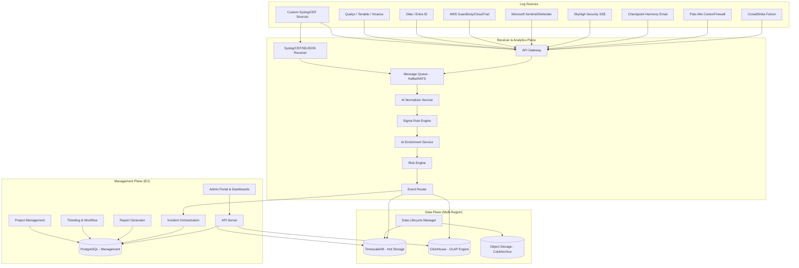
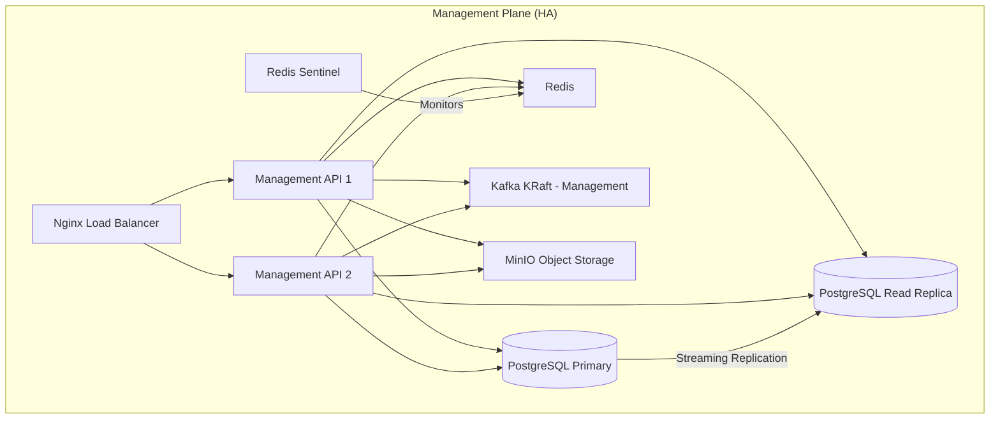
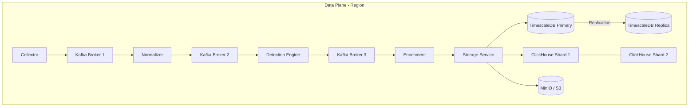
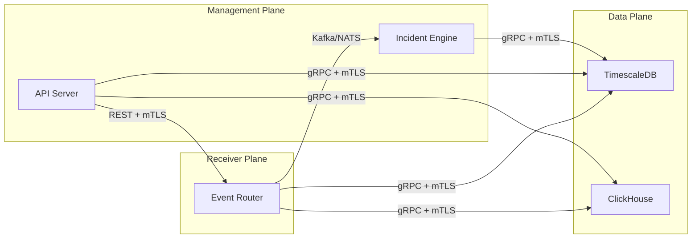
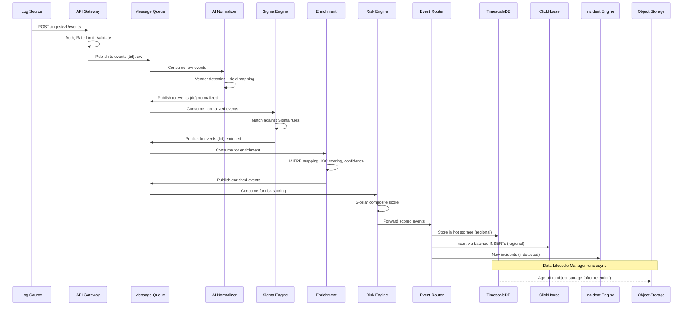
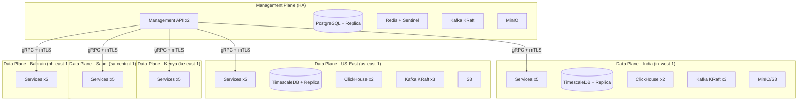

# SecureOps MSSP Platform - Multi-Plane Architecture

## Table of Contents

1. [Architecture Overview](#architecture-overview)
2. [AI Model Abstraction Layer](#ai-model-abstraction-layer)
3. [Cloud Object Storage Abstraction](#cloud-object-storage-abstraction)
4. [Receiver & Analytics Plane](#receiver--analytics-plane)
5. [Management Plane](#management-plane)
6. [Data Plane](#data-plane)
7. [Data Plane Region Registry & Routing](#data-plane-region-registry--routing)
8. [Data Lifecycle & Archival](#data-lifecycle--archival)
9. [Inter-Plane Communication](#inter-plane-communication)
10. [Data Flow](#data-flow)
11. [Multi-Cloud Deployment Topology](#multi-cloud-deployment-topology)
12. [Docker Compose Deployment](#docker-compose-deployment)
13. [Helm Chart Deployment](#helm-chart-deployment)
14. [Security & Compliance](#security--compliance)
15. [Scaling Strategy](#scaling-strategy)
16. [Migration Path](#migration-path)

---

## Architecture Overview

SecureOps is designed as a three-plane distributed architecture to support massive-scale MSSP operations across multiple regions and cloud providers. Each plane is independently deployable, scalable, and upgradeable.



### Design Principles

- **Plane Isolation**: Each plane can be deployed, scaled, and upgraded independently
- **Data Sovereignty**: Data Plane regions enforce data residency requirements per jurisdiction
- **Multi-Tenancy**: Tenant isolation at every layer (network, compute, storage)
- **Open Standards**: Sigma rules, MITRE ATT&CK, OpenTelemetry, Apache Parquet/Iceberg
- **Zero Trust**: mTLS between planes, RBAC at every API boundary
- **Vendor-Neutral AI**: Pluggable AI model abstraction supporting OpenAI, Anthropic, Ollama, Azure OpenAI, Vertex AI, HuggingFace, and custom OpenAI-compatible endpoints
- **Cloud-Agnostic Storage**: Unified cloud storage abstraction supporting S3, Azure Blob, GCS, and MinIO

---

## AI Model Abstraction Layer

SecureOps uses a vendor-neutral AI provider abstraction (`server/ai-provider.ts`) that allows switching between LLM providers without code changes. All AI calls across the platform go through a unified `createAIClient()` factory.

### Supported Providers

| Provider | `AI_PROVIDER` Value | Default Model | Default Base URL |
|----------|-------------------|---------------|-----------------|
| OpenAI | `openai` | `gpt-4o-mini` | OpenAI default |
| Anthropic | `anthropic` | `claude-sonnet-4-20250514` | `https://api.anthropic.com/v1` |
| Ollama | `ollama` | `llama3` | `http://localhost:11434/v1` |
| Azure OpenAI | `azure` | `gpt-4o-mini` | User-configured |
| Google Vertex AI | `vertex` | `gemini-pro` | User-configured |
| HuggingFace | `huggingface` | `meta-llama/Meta-Llama-3-8B-Instruct` | `https://api-inference.huggingface.co/v1` |
| Custom (OpenAI-compatible) | `custom` | User-configured | User-configured |

### Environment Variables

| Variable | Required | Description |
|----------|----------|-------------|
| `AI_PROVIDER` | No | Provider selection (default: `openai`) |
| `AI_MODEL` | No | Override default model for selected provider |
| `AI_API_KEY` | Yes | API key (falls back to `OPENAI_API_KEY`) |
| `AI_BASE_URL` | No | Custom endpoint URL (falls back to `OPENAI_BASE_URL`) |
| `AI_API_VERSION` | No | API version (used by Azure OpenAI) |

### Usage

All 9 AI integration points use the unified provider:
- `server/ai-soc-analyst.ts` - SOC Analyst AI agent
- `server/ai-agent-engine.ts` - Multi-agent orchestration
- `server/ai-normalizer.ts` - Event normalization fallback
- `server/ai-agents/report-agent.ts` - Report generation
- `server/asset-profile-enricher.ts` - Asset profile completion
- `server/routes.ts` - API-level AI features
- `server/integrations/chat/routes.ts` - Chat integration

### Self-Hosted Example

```bash
AI_PROVIDER=ollama
AI_BASE_URL=http://localhost:11434
AI_MODEL=llama3
```

---

## Cloud Object Storage Abstraction

SecureOps provides a unified cloud storage abstraction (`server/cloud-storage.ts`) for long-term data retention with read-back capability. The abstraction supports multiple cloud providers and a local development backend.

### Supported Providers

| Provider | `CLOUD_STORAGE_PROVIDER` | SDK | Use Case |
|----------|------------------------|-----|----------|
| AWS S3 | `s3` | `@aws-sdk/client-s3` | Production (AWS) |
| Azure Blob Storage | `azure` | `@azure/storage-blob` | Production (Azure) |
| Google Cloud Storage | `gcs` | `@google-cloud/storage` | Production (GCP) |
| MinIO | `minio` | `@aws-sdk/client-s3` (S3-compatible) | Local dev / self-hosted |
| In-Memory | (default fallback) | None | Development / testing |

### Interface

```typescript
interface CloudStorageService {
  upload(bucket, key, data, metadata): Promise<{ etag: string }>;
  download(bucket, key): Promise<{ data: Buffer; metadata }>;
  list(bucket, prefix, maxKeys, continuationToken): Promise<{ objects, nextToken, isTruncated }>;
  delete(bucket, key): Promise<void>;
  generatePresignedUrl(bucket, key, expirySeconds): Promise<string>;
  headObject(bucket, key): Promise<StorageObject | null>;
  ensureBucket(bucket): Promise<void>;
  getStorageStats(bucket, prefix): Promise<StorageStats>;
  determineTier(ageInDays, retentionPolicy): StorageTier;
  generateArchiveKey(tenantId, eventType, date, format): string;
}
```

### Data Lifecycle Tiers

| Tier | Age | Storage Class | Description |
|------|-----|--------------|-------------|
| Hot | 0-90 days | Database (PostgreSQL/TimescaleDB) | Active querying, full-speed access |
| Warm | 91-365 days | Standard object storage | Reduced access, standard pricing |
| Cold | 1-3 years | Infrequent Access / Nearline | Rare access, lower cost |
| Archive | 3+ years | Glacier / Archive / Coldline | Compliance retention, minimal access |

### Environment Variables

| Variable | Default | Description |
|----------|---------|-------------|
| `CLOUD_STORAGE_PROVIDER` | `minio` | Storage backend selection |
| `CLOUD_STORAGE_REGION` | `us-east-1` | Storage region |
| `CLOUD_STORAGE_BUCKET` | `secureops-data` | Default bucket name |
| `MINIO_ENDPOINT` | `http://localhost:9000` | MinIO endpoint |
| `MINIO_ACCESS_KEY` | `minioadmin` | MinIO access key |
| `MINIO_SECRET_KEY` | `minioadmin` | MinIO secret key |
| `AWS_ACCESS_KEY_ID` | - | AWS credentials |
| `AWS_SECRET_ACCESS_KEY` | - | AWS credentials |
| `AWS_S3_ENDPOINT` | - | Custom S3 endpoint |
| `AZURE_STORAGE_ACCOUNT_NAME` | - | Azure storage account |
| `AZURE_STORAGE_ACCOUNT_KEY` | - | Azure storage key |
| `AZURE_STORAGE_CONNECTION_STRING` | - | Azure connection string |
| `GCP_PROJECT_ID` | - | GCP project ID |
| `GCP_KEY_FILE_PATH` | - | GCP service account key file |

---

## Receiver & Analytics Plane

The Receiver & Analytics Plane is the ingestion and real-time processing layer. It can be deployed in any region or cloud to receive logs close to the source, minimizing latency and ensuring data residency.

### Components

#### API Gateway (REST/gRPC)

- **Protocol**: REST (HTTP/2) and gRPC for high-throughput integrations
- **Authentication**: API key (HMAC-SHA256), OAuth 2.0 client credentials, mTLS
- **Rate Limiting**: Per-tenant configurable rate limits (default: 10,000 EPS)
- **Payload Formats**: JSON, NDJSON, CSV, CEF, LEEF
- **Endpoints**:
  - `POST /ingest/v1/events` - Push API for structured events
  - `POST /ingest/v1/raw` - Raw log ingestion
  - `POST /ingest/v1/batch` - Batch file upload (CSV, Excel, PDF)
  - `gRPC IngestService.StreamEvents` - Streaming ingestion

```
Endpoint                        Protocol    Max Payload    Rate Limit
/ingest/v1/events               REST        10 MB          10,000 EPS/tenant
/ingest/v1/raw                  REST        50 MB          5,000 EPS/tenant
/ingest/v1/batch                REST        200 MB         100 req/min/tenant
IngestService.StreamEvents      gRPC        Streaming      50,000 EPS/tenant
```

#### Syslog/CEF/NDJSON Receiver

- **Protocols**: TCP (TLS 1.3), UDP, TCP+TLS for Syslog
- **Ports**: 514 (UDP), 6514 (TCP+TLS), 1514 (TCP)
- **Format Detection**: Auto-detect CEF, LEEF, RFC 5424, RFC 3164, JSON, NDJSON
- **Buffer**: In-memory ring buffer with disk spillover (configurable, default 1 GB)

#### Message Queue (Apache Kafka KRaft)

Kafka operates in KRaft mode (no ZooKeeper dependency) providing event buffering, replay capability, and decoupling between ingestion and processing.

- **Mode**: KRaft (controller + broker in single process)
- **Topic per tenant**: `events.{tenant_id}.raw`
- **Partitioned** by event type for parallel processing
- **Retention**: 7 days (configurable per tenant)
- **Replication factor**: 3 (production), 1 (development)
- **HA**: 3-node KRaft cluster with `min.insync.replicas=2`

**Topic Structure**:
```
events.{tenant_id}.raw              # Raw ingested events
events.{tenant_id}.normalized       # After AI normalization
events.{tenant_id}.enriched         # After enrichment + Sigma
events.{tenant_id}.scored           # After risk scoring
events.{tenant_id}.routed           # Ready for Data Plane storage
incidents.{tenant_id}.new           # New incidents for Management Plane
incidents.{tenant_id}.updated       # Incident updates/enrichments
```

#### AI Normalizer Service

Vendor detection and field mapping service that transforms heterogeneous log formats into a unified security event schema. Uses the vendor-neutral AI provider abstraction for fallback normalization of unknown formats.

- **Deterministic Normalizers**: Pre-built parsers for 20+ vendors
- **AI Fallback**: Configurable LLM provider via `AI_PROVIDER` env var
- **Field Mapping**: Maps vendor-specific fields to the SecureOps Normalized Event Schema
- **Entity Extraction**: IPs, domains, hashes (MD5/SHA1/SHA256), emails, hostnames, usernames

#### Sigma Rule Engine

SigmaHQ-compatible detection and correlation engine with 3,120+ rules.

- **Rule Format**: Standard Sigma YAML (SigmaHQ repository compatible)
- **Detection Logic**: Keyword matching, selection criteria, logsource filtering
- **Correlation Engine**: Temporal, entity, and threshold-based correlation
- **Performance**: Rule matching in < 5ms per event for up to 10,000 active rules

#### AI Enrichment Service

Contextual intelligence and threat enrichment powered by the pluggable AI abstraction layer.

- **MITRE ATT&CK Mapping**: Auto-map events to tactics (14) and techniques (200+)
- **Kill Chain Phase**: Lockheed Martin Cyber Kill Chain phase assignment
- **IOC Extraction & Reputation**: IP, domain, hash, email reputation scoring
- **Threat Narrative Generation**: AI-generated attack chain narratives for high-severity incidents
- **Confidence Scoring**: 0-100 score based on source reliability, indicator quality, and correlation strength

#### Risk Engine

Composite risk scoring engine implementing the SecureOps 5-pillar risk model.

- **Asset Risk Pillars** (weighted composite): Security Tool Coverage (25%), Vulnerability & Patch Status (25%), Incident History (20%), Compliance Posture (15%), Contextual Factors (15%)
- **User/Identity Risk Pillars** (weighted composite): Email Threat Exposure (30%), Web Browsing Risk (25%), Incident Involvement (20%), Behavioral Risk (15%), Contextual Factors (10%)

#### Event Router

Routes processed events to the appropriate Data Plane region based on tenant configuration and data residency requirements via the Data Plane Registry.

### Auto-Scaling Configuration

| Component | Metric | Scale Trigger | Min | Max |
|-----------|--------|---------------|-----|-----|
| API Gateway | Requests/sec | > 5,000 RPS | 2 | 20 |
| Syslog Receiver | Connection count | > 500 connections | 2 | 10 |
| Normalizer Workers | Kafka consumer lag | > 10,000 messages | 2 | 50 |
| Sigma Engine | CPU utilization | > 70% | 2 | 20 |
| Enrichment Workers | Queue depth | > 5,000 pending | 2 | 30 |
| Risk Scorer | CPU utilization | > 70% | 2 | 10 |

---

## Management Plane

The Management Plane is the central control and orchestration layer. It is deployed with HA (2+ replicas behind Nginx load balancer) with PostgreSQL streaming replication and Redis Sentinel for session caching.

### Components

#### API Server

- **Framework**: Express.js (Node.js 20+)
- **Authentication**: Username/password with Passport.js, session storage in PostgreSQL (connect-pg-simple)
- **Authorization**: RBAC with 4 role levels: `platform_admin`, `mss_admin`, `mss_analyst`, `customer`
- **Tenant Isolation**: Middleware enforces tenant boundary on every request
- **AI Provider**: Vendor-neutral via `createAIClient()` abstraction

#### Incident Orchestration & Workflow Engine

- **Incident Lifecycle**: New -> Investigating -> Contained -> Resolved -> Closed
- **Auto-Classification**: AI-powered TP/FP classification with confidence scoring
- **Enrichment Pipeline**: MITRE ATT&CK, Kill Chain, IOC correlation, threat narrative
- **Bulk Operations**: Batch enrichment of up to 100 incidents using AI
- **Dedup**: SHA-256 hash-based incident deduplication

#### Report Generator

- **Report Types**: 13 AI-generated report types with professional PDF output
- **PDF Engine**: pdfkit with branded templates
- **AI Integration**: Uses configurable AI provider for executive summary generation

#### Admin Portal

- **Data Plane Management**: View and manage regional data plane status
- **Tenant Retention Policies**: Configure per-tenant data retention settings
- **Archived Data Browser**: Browse and download archived data from cloud storage
- **Platform Health**: Real-time health monitoring for all data plane regions

### Management Plane Database Schema

```
tenants                 # Tenant hierarchy with dataRegion assignment
users                   # User accounts with multi-role support
sessions                # Active sessions
incidents               # Incident metadata and workflow state
tickets                 # Support tickets with SLA tracking
projects                # Implementation projects
project_tasks           # Kanban board tasks
reports                 # Generated reports metadata
services                # Service definitions with MSA/SLA
shift_rosters           # Team shift schedules
knowledge_base_docs     # Knowledge base documents
compliance_frameworks   # NIST CSF, ISO 27001 mappings
ingest_api_keys         # API keys for data ingestion
ingest_batches          # Batch processing tracking
connectors              # Data source connector configs
risk_scores             # Cached risk score snapshots
sigma_rules             # Sigma rule definitions
```

### Tenant Schema Extensions

The tenants table includes data plane and retention policy fields:

| Field | Type | Description |
|-------|------|-------------|
| `dataRegion` | `text` | Assigned data plane region (e.g., `in-west-1`, `us-east-1`) |
| `retentionHotDays` | `integer` | Hot storage retention (default: 90) |
| `retentionWarmDays` | `integer` | Warm storage retention (default: 365) |
| `retentionColdDays` | `integer` | Cold storage retention (default: 1095) |
| `archiveStorageProvider` | `text` | Override storage provider per tenant |

### Management Plane Deployment



---

## Data Plane

The Data Plane provides multi-region event storage, search, and data lifecycle management. Each region is independently deployed to satisfy data residency requirements.

### Regions

| Region ID | Location | Cloud Provider | AWS Region | Primary Tenants |
|-----------|----------|---------------|------------|-----------------|
| `in-west-1` | Mumbai, India | AWS | `ap-south-1` | India-based clients |
| `us-east-1` | Virginia, USA | AWS | `us-east-1` | US clients |
| `ke-east-1` | Nairobi, Kenya | AWS | `af-south-1` | East Africa clients |
| `sa-central-1` | Riyadh, Saudi Arabia | AWS | `me-central-1` | Saudi Arabia clients |
| `bh-east-1` | Manama, Bahrain | AWS | `me-south-1` | Middle East clients |

### Components

#### TimescaleDB - Hot Storage

- **Engine**: TimescaleDB (PostgreSQL extension) for time-series optimized storage
- **Retention**: Configurable per tenant (default: 90 days hot)
- **Replication**: Primary + read replica with streaming replication
- **HA**: Automated failover via PostgreSQL streaming replication

#### ClickHouse - OLAP Engine

- **Engine**: ClickHouse 24.3 (2-node HA cluster)
- **Index Pattern**: `secureops-events-{tenant_id}-{YYYY.MM}`
- **Cross-Cluster Search**: Federated search across regional clusters

#### Object Storage - Cold/Archive

Uses the Cloud Storage Abstraction Layer:
- **Format**: Apache Parquet (columnar, compressed)
- **Partitioning**: `tenant_id / year / month / day / event_type`
- **Provider**: Configurable per region (S3/Azure Blob/GCS/MinIO)

#### Apache Kafka - Event Pipeline

- **Mode**: KRaft (3-node cluster, no ZooKeeper)
- **Partitions**: 12 per topic
- **Replication Factor**: 3
- **Min In-Sync Replicas**: 2
- **Retention**: 168 hours (7 days)

### Data Plane Services

| Service | Port | Description |
|---------|------|-------------|
| Collector | 5001 | Multi-source event collection (polling + push) |
| Normalizer | 5002 | Vendor-specific format normalization |
| Detection Engine | 5003 | Sigma rule matching + MITRE enrichment |
| Enrichment | 5004 | IOC scoring, correlation, threat narratives |
| Storage | 5005 | Event persistence, incident generation, archival |

### Data Plane Deployment (Per Region)



---

## Data Plane Region Registry & Routing

The Data Plane Registry (`server/data-plane-registry.ts`) manages regional data plane definitions and tenant-to-region mapping.

### Registry Structure

Each registered region contains:

```typescript
interface DataPlaneRegion {
  id: string;                    // e.g., "in-west-1"
  name: string;                  // e.g., "India (Mumbai)"
  location: string;              // e.g., "Mumbai, India"
  cloudProvider: string;         // e.g., "AWS"
  dbConnectionString: string;    // Regional TimescaleDB connection
  storageEndpoint: string;       // Regional object storage endpoint
  kafkaBrokers: string[];        // Regional Kafka broker list
  status: "active" | "standby" | "degraded";
  isPrimary: boolean;
  metadata?: Record<string, any>; // AWS region, timezone, etc.
}
```

### Routing Logic

The `DataPlaneRouter` routes queries to the correct regional data plane:
1. Look up tenant's assigned `dataRegion`
2. Resolve to the registered region
3. If region is degraded, fall back to primary region
4. If no region assigned, route to primary (default: `in-west-1`)

### Management API Endpoints

| Endpoint | Method | Description |
|----------|--------|-------------|
| `/api/admin/data-planes` | GET | List all registered data plane regions |
| `/api/admin/data-planes/:regionId` | PUT | Update region configuration |
| `/api/admin/data-planes/:regionId/health` | GET | Get region health status |
| `/api/admin/platform-health/data-planes` | GET | Health overview for all regions |

### Region Environment Variables

Each region's connection details are configured via environment variables:

```bash
DP_IN_WEST_1_DB_URL=postgresql://...
DP_IN_WEST_1_STORAGE_URL=https://s3.ap-south-1.amazonaws.com
DP_IN_WEST_1_KAFKA_BROKERS=broker1:9092,broker2:9092,broker3:9092

DP_US_EAST_1_DB_URL=postgresql://...
DP_US_EAST_1_STORAGE_URL=https://s3.us-east-1.amazonaws.com
DP_US_EAST_1_KAFKA_BROKERS=broker1:9092,broker2:9092,broker3:9092
```

---

## Data Lifecycle & Archival

### Retention Policies

Per-tenant configurable retention with four tiers:

| Tier | Default Duration | Storage | Access Pattern |
|------|-----------------|---------|---------------|
| Hot | 0-90 days | TimescaleDB | Real-time queries |
| Warm | 91-365 days | Standard S3/Blob/GCS | Occasional lookups |
| Cold | 1-3 years | S3 IA / Cool Blob / Nearline | Rare access |
| Archive | 3+ years | Glacier / Archive / Coldline | Compliance only |

### Archival API Endpoints

| Endpoint | Method | Description |
|----------|--------|-------------|
| `/api/data-plane/archive` | POST | Trigger archival of aged events |
| `/api/data-plane/:region/storage/browse` | GET | List archived data by tenant/date |
| `/api/data-plane/:region/storage/download/:key` | GET | Stream archived data |
| `/api/data-plane/:region/storage/stats` | GET | Storage usage statistics |
| `/api/tenants/:id/retention-policy` | PUT | Configure tenant retention |

### Archive Key Format

```
{tenantId}/{eventType}/{YYYY}/{MM}/{DD}/{timestamp}.parquet
```

---

## Inter-Plane Communication

### Communication Patterns



### Protocol Details

| From | To | Protocol | Purpose | Auth |
|------|----|----------|---------|------|
| Receiver -> Data Plane | gRPC (HTTP/2) | Event storage and indexing | mTLS (X.509 certificates) |
| Receiver -> Management | Kafka/NATS | New incident notifications | Kafka ACLs / NATS NKey |
| Management -> Data Plane | gRPC (HTTP/2) | Query events, dashboards, reports | mTLS + tenant token |
| Management -> Receiver | REST (HTTPS) | Configuration updates, health checks | mTLS + API key |
| Dashboard -> Management | REST (HTTPS) | All user-facing operations | Session cookie + CSRF |

### Service Discovery

- **Kubernetes**: Native service discovery via DNS (CoreDNS)
- **Cross-Region**: Consul service mesh or AWS Cloud Map / GCP Service Directory
- **Health Checks**: gRPC health checking protocol + HTTP `/healthz` endpoints
- **Circuit Breakers**: Client-side circuit breakers with exponential backoff

---

## Data Flow

### End-to-End Event Processing Flow



### Resilience & Retry Behavior

The ingestion pipeline implements **6 layers of retry and recovery** to handle transient failures without data loss:

1. **ClickHouse HTTP Client Retry** — 3 attempts with exponential backoff for 5xx/connection errors (`clickhouse-client.ts`).
2. **Security Events Sweeper** — Cursor-based PG→CH backfill that deduplicates via CH existence query; cursor advances only on success (`storage.ts`).
3. **Live Dual-Write Retry** — 3 attempts with backoff for `chDualWrite()`; PG remains authoritative (`storage.ts`).
4. **Connector HTTP Retry** — 2 retries for transient network errors in all `BaseConnector` subclasses (`base-connector.ts`).
5. **Automatic DLQ Retry** — 60s background job replays failed DLQ entries up to `max_retries` (`index.ts`).
6. **Schema Init Retry Loop** — 5 attempts with exponential backoff (2s→32s) so CH outages at deploy time don't permanently disable analytics (`index.ts`).

---

## Multi-Cloud Deployment Topology

### Global Topology



### Cloud Provider Resource Mapping

| Component | GCP | AWS | Azure |
|-----------|-----|-----|-------|
| Kubernetes | GKE Autopilot | EKS Fargate | AKS |
| PostgreSQL | Cloud SQL | RDS | Azure Database for PostgreSQL |
| TimescaleDB | Cloud SQL + TimescaleDB | RDS + TimescaleDB | Azure DB + TimescaleDB |
| Object Storage | GCS | S3 | Azure Blob |
| Message Queue | Confluent Cloud | MSK (Kafka) | Event Hubs |
| Search | Elastic Cloud | ClickHouse OLAP Cluster | Azure Cognitive Search |
| Load Balancer | Cloud Load Balancing | ALB/NLB | Azure Application Gateway |

---

## Docker Compose Deployment

SecureOps provides three Docker Compose configurations for different deployment scenarios:

### Management Plane (`docker-compose.microservices.yml`)

Starts the management plane with HA:

```bash
docker-compose -f docker-compose.microservices.yml up -d
```

**Services included:**
- `management-db` - PostgreSQL 16 with streaming replication
- `management-db-replica` - PostgreSQL read replica
- `redis` - Redis 7 with Sentinel for HA
- `kafka-mgmt` - Kafka KRaft (single broker for management)
- `minio` - MinIO object storage
- `nginx` - Load balancer (port 80/443)
- `management-1` / `management-2` - HA management API instances

### Data Plane (`docker-compose.data-plane.yml`)

Starts a regional data plane (reusable template):

```bash
DATA_PLANE_REGION=in-west-1 DATA_PLANE_REGION_NAME="India (Mumbai)" \
  docker-compose -f docker-compose.data-plane.yml up -d
```

**Services included:**
- `data-plane-db` - TimescaleDB with streaming replication
- `data-plane-db-replica` - TimescaleDB read replica
- `clickhouse-1` / `clickhouse-2` - ClickHouse 2-node HA cluster
- `kafka-1` / `kafka-2` / `kafka-3` - Kafka KRaft 3-node HA cluster
- `minio` - Regional MinIO instance
- `collector` / `normalizer` / `detection-engine` / `enrichment` / `storage` - Pipeline services

### Combined Development (`docker-compose.multi-plane.yml`)

Starts both planes on a single machine for development:

```bash
docker-compose -f docker-compose.multi-plane.yml up -d
```

### All Images

All container images use open-source bases:

| Image | Version | Purpose |
|-------|---------|---------|
| `node:20-alpine` | 20.x | Application services |
| `postgres:16-alpine` | 16.x | Management database |
| `timescale/timescaledb:latest-pg16` | Latest | Data plane event storage |
| `bitnami/kafka:3.8` | 3.8 | Message queue (KRaft mode) |
| `clickhouse/clickhouse-server:24.3` | 24.3 | OLAP engine (single source of truth for security events) |
| `minio/minio:latest` | Latest | S3-compatible object storage |
| `redis:7-alpine` | 7.x | Session cache |
| `nginx:1.27-alpine` | 1.27 | Load balancer |

---

## Helm Chart Deployment

### Chart Location

```
deploy/helm/secureops/
  Chart.yaml
  values.yaml               # Default HA values
  regional/                  # Per-region overrides
    values-india.yaml
    values-us-east.yaml
    values-kenya.yaml
    values-saudi.yaml
    values-bahrain.yaml
  values/                    # Alternative values directory
    india.yaml
    us-east.yaml
    eu-west.yaml
    kenya.yaml
    saudi.yaml
    bahrain.yaml
  templates/                 # Kubernetes manifests
```

### HA Defaults (values.yaml)

All components default to HA configuration:

| Component | Min Replicas | Max Replicas | PDB Min Available |
|-----------|-------------|-------------|-------------------|
| Management | 2 | 6 | 2 |
| Receiver | 2 | 20 | 1 |
| Data Plane | 2 | 10 | 1 |
| Collector | 2 | 10 | 1 |
| Normalizer | 2 | 15 | 1 |
| Detection Engine | 2 | 10 | 1 |
| Enrichment | 2 | 8 | 1 |
| Storage | 2 | 6 | 1 |
| Kafka KRaft | 3 | 3 | 2 |
| Redis | 3 | 3 | 1 |
| ClickHouse | 2 | 2 | 1 |

Anti-affinity rules spread pods across availability zones using `topology.kubernetes.io/zone`.

### Regional Deployment

```bash
helm install secureops deploy/helm/secureops/ \
  -f deploy/helm/secureops/regional/values-india.yaml

helm install secureops deploy/helm/secureops/ \
  -f deploy/helm/secureops/regional/values-us-east.yaml
```

### Regional Configuration Details

| Region | AWS Region | Zones | Storage Class | Kafka Partitions | Compliance |
|--------|-----------|-------|--------------|-----------------|------------|
| India | `ap-south-1` | a, b, c | `gp3` | 12 | IT-Act-2000 |
| US East | `us-east-1` | a, b, c | `gp3` | 12 | SOC2, HIPAA |
| Kenya | `af-south-1` | a, b | `gp3` | 12 | KDPA |
| Saudi | `me-central-1` | a, b, c | `gp3` | 12 | PDPL, NCA-ECC |
| Bahrain | `me-south-1` | a, b, c | `gp3` | 12 | PDPL |

---

## Security & Compliance

### Authentication & Authorization

- **External Users**: Username/password with MFA (TOTP), OAuth 2.0/OIDC federation
- **Inter-Service**: mTLS with X.509 certificates (auto-rotated via cert-manager)
- **API Keys**: HMAC-SHA256 hashed, prefix-based lookup, per-tenant scoping
- **RBAC**: Role hierarchy with tenant boundary enforcement at middleware level

### Data Protection

- **Encryption at Rest**: AES-256 (cloud-managed KMS)
- **Encryption in Transit**: TLS 1.3 (external), mTLS (inter-plane)
- **Field-Level Encryption**: Sensitive fields (PII) encrypted with tenant-specific keys
- **Key Management**: Cloud KMS with automatic key rotation (90-day cycle)

### Compliance Frameworks

- **SOC 2 Type II**: Audit logging, access controls, encryption
- **GDPR**: Data residency enforcement, right to deletion, data processing agreements
- **ISO 27001**: Information security management controls
- **NIST CSF 2.0**: Mapped controls across all platform features
- **PCI DSS**: Network segmentation, encryption, access controls (where applicable)

### Audit Trail

- All API calls logged with user, action, resource, timestamp
- All data access logged with tenant context
- Immutable audit log storage (append-only, separate from operational data)
- 7-year retention for audit logs

---

## Scaling Strategy

### Capacity Planning

| Metric | Small MSSP | Medium MSSP | Large MSSP |
|--------|-----------|-------------|------------|
| Tenants | 1-10 | 10-100 | 100-1,000 |
| Events/Second | 100-1,000 | 1,000-50,000 | 50,000-500,000 |
| Events/Day | 10M | 500M | 5B |
| Hot Storage | 100 GB | 5 TB | 50 TB |
| Cold Storage/Year | 1 TB | 50 TB | 500 TB |
| Data Plane Regions | 1 | 1-2 | 3-6 |

### Horizontal Scaling

- **Receiver Plane**: Scale horizontally by adding Kafka partitions + consumer pods
- **Management Plane**: Stateless app servers behind Nginx load balancer; PostgreSQL read replicas for query offload
- **Data Plane**: Scale storage independently per region; add ClickHouse shards for OLAP throughput

---

## Migration Path

### Phase 1: Current State (Monolith)

The current SecureOps platform runs as a single Express.js application. All processing happens in-process with automatic Kafka fallback.

### Phase 2: Extract Receiver Plane

1. Deploy Kafka (KRaft mode) alongside existing application
2. The `server/kafka/` module auto-detects Kafka availability
3. Extract AI Normalizer and Sigma Engine as separate workers

### Phase 3: Separate Data Plane

1. Deploy TimescaleDB for event storage
2. Deploy ClickHouse for OLAP indexing
3. Configure cloud object storage for cold/archive tier
4. Set up Data Plane Registry with initial regions

### Phase 4: Multi-Region Data Planes

1. Deploy data plane per region using `docker-compose.data-plane.yml`
2. Configure tenant-to-region mapping via admin portal
3. Set up inter-region VPN/private connectivity
4. Configure per-tenant retention policies

### Phase 5: Full Production

1. Deploy Management Plane with HA via `docker-compose.microservices.yml`
2. Deploy regional data planes via Helm charts
3. Enable platform health monitoring across all regions
4. Configure data archival and lifecycle management

### Backward Compatibility

Each phase maintains backward compatibility:
- API contracts are versioned and additive
- Database migrations are forward-compatible
- Existing tenant configurations are preserved
- Zero-downtime deployments via rolling updates
