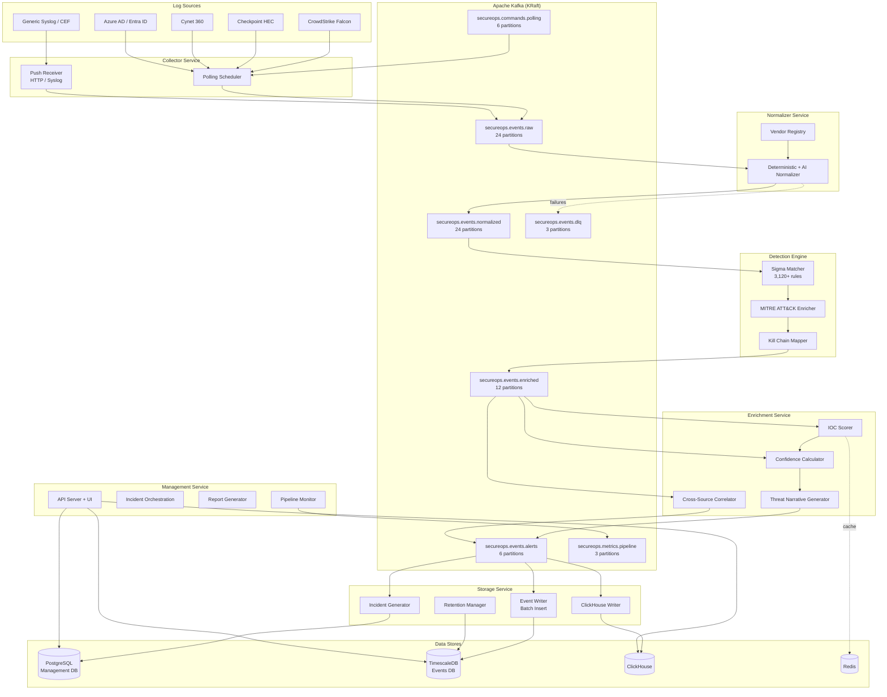

# SecureOps Microservices Architecture

## Table of Contents

1. [System Architecture Overview](#system-architecture-overview)
2. [Kafka Topic Map](#kafka-topic-map)
3. [Microservice Responsibility Matrix](#microservice-responsibility-matrix)
4. [Service Details](#service-details)
5. [Scaling Guidelines](#scaling-guidelines)
6. [Failure Modes & Recovery](#failure-modes--recovery)
7. [Local Development Workflow](#local-development-workflow)
8. [Migration Guide: Monolith to Microservices](#migration-guide-monolith-to-microservices)
9. [Performance Benchmarks & Capacity Planning](#performance-benchmarks--capacity-planning)

---

## System Architecture Overview

The SecureOps MSSP platform has been decomposed from a 3-plane monolith into 7 dedicated microservices connected by Apache Kafka (KRaft mode, no Zookeeper). Each service is independently deployable, scalable, and observable.



### Design Principles

- **Event-Driven**: All inter-service communication flows through Kafka topics
- **Stateless Services**: Every microservice (except Storage) is stateless and scales horizontally
- **Backpressure-Aware**: Consumer lag and write latency drive pause/resume behavior
- **Graceful Degradation**: Kafka unavailability triggers fallback to direct in-process pipeline
- **Observability**: Every service publishes metrics to `secureops.metrics.pipeline`

---

## Kafka Topic Map

| Topic | Partitions | Replication | Retention | Key | Description |
|-------|-----------|-------------|-----------|-----|-------------|
| `secureops.events.raw` | 24 | 3 | 7 days | `tenantId` | Raw events from connectors and push sources |
| `secureops.events.normalized` | 24 | 3 | 7 days | `tenantId` | After vendor-specific field mapping |
| `secureops.events.enriched` | 12 | 3 | 7 days | `tenantId` | After Sigma + MITRE + Kill Chain enrichment |
| `secureops.events.alerts` | 6 | 3 | 30 days | `tenantId` | Confirmed incidents ready for persistence |
| `secureops.events.dlq` | 3 | 3 | 30 days | `tenantId` | Failed processing with error context |
| `secureops.commands.polling` | 6 | 3 | 1 day | `connectorId` | Management-to-collector commands |
| `secureops.metrics.pipeline` | 3 | 3 | 3 days | `serviceName` | Pipeline telemetry from all services |

### Topic Configuration

All topics use:
- **Compression**: Snappy (configured at topic level)
- **Cleanup Policy**: Delete (time-based retention)
- **Auto-creation**: Topics are auto-created on startup via `server/kafka/admin.ts`
- **Replication**: Factor of 3 in production, 1 in development

### Data Flow

```
Log Sources
    |
    v
[Collector] ---> secureops.events.raw
                        |
                        v
                [Normalizer] ---> secureops.events.normalized
                                        |
                                        v
                                [Detection Engine] ---> secureops.events.enriched
                                                              |
                                                              v
                                                      [Enrichment] ---> secureops.events.alerts
                                                                              |
                                                                              v
                                                                        [Storage] ---> PostgreSQL / ClickHouse
```

---

## Microservice Responsibility Matrix

| Service | Consumes | Produces | Primary Store | Scaling Dimension | Port |
|---------|----------|----------|---------------|-------------------|------|
| **Collector** | `commands.polling` | `events.raw` | None (stateless) | Tenant count, connector count | 5001 |
| **Normalizer** | `events.raw` | `events.normalized`, `events.dlq` | None (stateless) | Event volume (CPU-bound) | 5002 |
| **Detection Engine** | `events.normalized` | `events.enriched` | In-memory rule index | Event volume (memory-bound) | 5003 |
| **Enrichment** | `events.enriched` | `events.alerts` | Redis (IOC cache) | Event volume, API calls | 5004 |
| **Storage** | `events.alerts` | None | PostgreSQL, ClickHouse | Write throughput | 5005 |
| **Management** | `metrics.pipeline` | `commands.polling` | PostgreSQL | User concurrency | 5000 |
| **Kafka** | N/A | N/A | Disk (log segments) | Topic throughput | 9092 |

---

## Service Details

### Collector Service (`services/collector/`)

**Purpose**: Multi-source event collection via polling and push ingestion.

- **Polling Scheduler**: Parallel tenant polling with configurable concurrency (default 5)
- **Continuation Polling**: Loops while `hasMore=true`, max 10,000 events per cycle
- **Circuit Breaker**: 5 consecutive failures trigger 5-minute cooldown per connector
- **Push Receiver**: HTTP endpoints and Syslog (UDP 514, TCP 1514, TLS 6514)
- **Connectors**: Checkpoint HEC, CrowdStrike, Cynet, Azure AD, Generic Syslog

**Environment Variables**:
| Variable | Default | Description |
|----------|---------|-------------|
| `POLLING_CONCURRENCY` | 5 | Max parallel tenant polls |
| `MAX_EVENTS_PER_CYCLE` | 10000 | Event cap per polling cycle |
| `CIRCUIT_BREAKER_THRESHOLD` | 5 | Failures before cooldown |
| `CIRCUIT_BREAKER_COOLDOWN_MS` | 300000 | Cooldown duration (5 min) |
| `MANAGEMENT_PLANE_URL` | - | URL of management service |

### Normalizer Service (`services/normalizer/`)

**Purpose**: Transform vendor-specific log formats into the unified SecureOps event schema.

- **Vendor Registry**: Plugin-based vendor detection with field signature matching
- **Deterministic Normalizers**: Pre-built parsers for 20+ vendors
- **AI Fallback**: OpenAI gpt-4o-mini for unknown/new vendor formats
- **DLQ Routing**: Failed normalizations sent to `secureops.events.dlq` with error context

**Environment Variables**:
| Variable | Default | Description |
|----------|---------|-------------|
| `CONSUMER_CONCURRENCY` | 10 | Parallel processing threads |
| `OPENAI_API_KEY` | - | For AI fallback normalization |

### Detection Engine (`services/detection-engine/`)

**Purpose**: Real-time Sigma rule matching with MITRE ATT&CK and Kill Chain enrichment.

- **Sigma Matcher**: 3,120+ rules loaded into memory at startup
- **Hot Reload**: Rules refreshed via HTTP `POST /rules/reload` or Kafka commands
- **Per-Tenant Overrides**: Custom rule configurations per tenant
- **Batch Processing**: 100 events per batch for throughput optimization
- **Sub-100ms**: Target processing latency per event

**Environment Variables**:
| Variable | Default | Description |
|----------|---------|-------------|
| `SIGMA_RULES_PATH` | `/app/sigma-rules` | Path to Sigma rule YAML files |
| `BATCH_SIZE` | 100 | Events per processing batch |

### Enrichment Service (`services/enrichment/`)

**Purpose**: IOC scoring, confidence calculation, threat narrative generation, and cross-source correlation.

- **IOC Scorer**: IP, domain, hash, and email reputation scoring
- **Redis Cache**: IOC reputation lookups cached with 1-hour TTL
- **Confidence Calculator**: 0-100 score based on source reliability, MITRE presence, IOC hits
- **Threat Narrative**: AI-generated attack chain narratives for high-severity events
- **Correlation Engine**: Cross-source entity correlation (IOCs in 2+ event types)

**Environment Variables**:
| Variable | Default | Description |
|----------|---------|-------------|
| `IOC_CACHE_TTL_MS` | 3600000 | Redis cache TTL (1 hour) |
| `CORRELATION_WINDOW_MS` | 300000 | Correlation time window (5 min) |
| `OPENAI_API_KEY` | - | For threat narrative generation |

### Storage Service (`services/storage/`)

**Purpose**: Persist enriched events and generate incidents.

- **Event Writer**: Batch insert to `security_events` table (500 events/batch)
- **SHA-256 Dedup**: Hash-based deduplication via `event_hash` column
- **Incident Generator**: Auto-create incidents with dedup, severity classification, tenant grouping
- **ClickHouse Writer**: Parallel full-text indexing
- **Retention Manager**: Hot/warm/cold storage lifecycle management
- **Backpressure**: Pauses Kafka consumer when DB write latency exceeds 5 seconds

**Environment Variables**:
| Variable | Default | Description |
|----------|---------|-------------|
| `BATCH_SIZE` | 500 | Events per DB batch insert |
| `BACKPRESSURE_LATENCY_MS` | 5000 | Write latency threshold for pause |
| `HOT_RETENTION_DAYS` | 90 | Hot tier (ClickHouse) retention |
| `WARM_RETENTION_DAYS` | 365 | Warm tier retention |
| `COLD_RETENTION_DAYS` | 1095 | Cold tier retention (3 years) |

### Management Service (root project)

**Purpose**: UI, API, incident orchestration, reporting, and pipeline monitoring.

- Serves the React frontend and Express API
- Orchestrates incident workflows and AI enrichment
- Generates PDF reports
- Aggregates pipeline metrics from all services
- Publishes polling commands to collectors

---

## Scaling Guidelines

### When to Scale Each Service

| Service | Scale Trigger | Indicator | Action |
|---------|--------------|-----------|--------|
| **Collector** | New tenants / connectors added | Polling cycle time > 60s | Add replicas (each handles subset of tenants via partition assignment) |
| **Normalizer** | Kafka consumer lag on `events.raw` > 10,000 | CPU utilization > 70% | Add replicas (CPU-bound, stateless) |
| **Detection Engine** | Processing latency > 100ms/event | Memory utilization > 80% | Add replicas (memory-bound due to rule index) |
| **Enrichment** | Consumer lag on `events.enriched` > 5,000 | API rate limits hit | Add replicas; increase Redis cache TTL |
| **Storage** | Write latency > 3s (approaching 5s backpressure limit) | Consumer lag on `events.alerts` | Add replicas; tune batch size; scale DB |
| **Management** | API response time > 2s | Active user sessions > 500 | Add replicas behind load balancer |
| **Kafka** | Broker disk usage > 80% | Under-replicated partitions > 0 | Add brokers; increase retention cleanup |

### Kubernetes HPA Configuration

| Service | Min Replicas | Max Replicas | CPU Request | CPU Limit | Memory Request | Memory Limit |
|---------|-------------|-------------|-------------|-----------|----------------|--------------|
| Collector | 2 | 10 | 500m | 2000m | 512Mi | 2Gi |
| Normalizer | 2 | 15 | 500m | 2000m | 512Mi | 2Gi |
| Detection Engine | 2 | 10 | 500m | 2000m | 1Gi | 4Gi |
| Enrichment | 1 | 8 | 500m | 2000m | 512Mi | 2Gi |
| Storage | 2 | 6 | 500m | 2000m | 1Gi | 2Gi |
| Management | 3 | 6 | 500m | 2000m | 512Mi | 2Gi |

### Regional Value Overrides

Helm value files in `deploy/helm/secureops/values/` provide per-region configurations:

| Region | File | Notes |
|--------|------|-------|
| India | `india.yaml` | Primary for India-based clients |
| US East | `us-east.yaml` | Virginia, AWS/Azure |
| EU West | `eu-west.yaml` | Ireland/Frankfurt |
| Kenya | `kenya.yaml` | East Africa via South Africa |
| Saudi Arabia | `saudi.yaml` | Jeddah/Riyadh |
| Bahrain | `bahrain.yaml` | Middle East AWS region |

---

## Failure Modes & Recovery

### Kafka Unavailable

| Impact | Behavior | Recovery |
|--------|----------|----------|
| All services | Fallback to direct in-process pipeline (monolith mode) | Automatic reconnection with exponential backoff |
| Metrics | Local metrics buffer continues collecting | Flushed to Kafka when connection restored |
| No data loss | Events processed synchronously instead of via Kafka | Performance degrades but functionality preserved |

### Individual Service Failures

| Failed Service | Impact | Mitigation |
|----------------|--------|------------|
| **Collector** | No new events ingested | Other collector pods take over partitions via consumer group rebalance |
| **Normalizer** | Raw events queue in Kafka | Consumer lag grows; events processed when service recovers (7-day retention) |
| **Detection Engine** | Events pass through without Sigma matching | Enrichment still applies IOC scoring; detection catches up on recovery |
| **Enrichment** | Events stored without IOC/confidence data | Storage service still persists events; re-enrichment possible |
| **Storage** | Events queue in `events.alerts` topic | 30-day topic retention provides buffer; batch catchup on recovery |
| **Management** | UI/API unavailable | Pipeline continues processing; incidents queued for display |
| **Redis** | IOC cache misses | Enrichment falls back to direct lookups (slower but functional) |
| **ClickHouse** | Full-text search unavailable | PostgreSQL queries still work; events still persisted |

### Database Failures

| Scenario | Impact | Recovery |
|----------|--------|----------|
| PostgreSQL Management DB down | API/UI unavailable, no incident creation | Kafka buffers alerts; failover to read replica |
| TimescaleDB Events DB down | No event persistence | Storage service backpressure pauses consumer; events buffered in Kafka |
| Both DBs down | Full pipeline stalls at storage layer | Kafka provides 30-day buffer for alerts topic |

### Recovery Procedures

1. **Service crash loop**: Check logs, verify environment variables, ensure dependent services are healthy
2. **Kafka partition reassignment**: Automatic via consumer group protocol; monitor for rebalance storms
3. **Database connection pool exhaustion**: Scale down consumer concurrency; increase pool size
4. **DLQ overflow**: Inspect `secureops.events.dlq` for patterns; fix normalizer rules; replay events
5. **Memory pressure on Detection Engine**: Reduce loaded rule count; increase memory limits; shard by tenant

---

## Local Development Workflow

### Running the Full Stack

```bash
# Start all microservices with Docker Compose
docker-compose -f docker-compose.microservices.yml up

# Services are available at:
# Management UI/API:  http://localhost:5000
# Collector:          http://localhost:5001
# Normalizer:         http://localhost:5002
# Detection Engine:   http://localhost:5003
# Enrichment:         http://localhost:5004
# Storage:            http://localhost:5005
# Kafka:              localhost:9092
# PostgreSQL (mgmt):  localhost:5432
# PostgreSQL (events):localhost:5433
# ClickHouse:         http://localhost:8123
# Redis:              localhost:6379
```

### Running a Subset of Services

For frontend/API development, run only the management service in monolith mode:

```bash
# Monolith mode (no Kafka required)
npm run dev

# The monolith automatically falls back to direct in-process
# pipeline when Kafka is unavailable
```

For pipeline development, run infrastructure + specific services:

```bash
# Start only infrastructure
docker-compose -f docker-compose.microservices.yml up kafka redis management-db data-plane-db clickhouse

# Run individual services locally
cd services/normalizer && npm run dev
cd services/detection-engine && npm run dev
```

### Environment Setup

```bash
# Copy environment template
cp .env.microservices.example .env

# Required variables:
# DB_PASSWORD          - PostgreSQL password
# SESSION_SECRET       - Express session secret
# OPENAI_API_KEY       - For AI features (normalizer, enrichment, reports)
```

### Testing the Pipeline

```bash
# Push a test event via the collector's push endpoint
curl -X POST http://localhost:5001/push \
  -H "Content-Type: application/json" \
  -d '{"tenantId": 1, "source": "test", "events": [{"type": "endpoint", "severity": "high", "description": "Test alert"}]}'

# Check pipeline metrics
curl http://localhost:5000/api/pipeline/metrics

# View Kafka consumer lag
curl http://localhost:5000/api/pipeline/metrics | jq '.consumerLag'
```

---

## Migration Guide: Monolith to Microservices

### Phase 1: Kafka Infrastructure (No Service Changes)

1. Deploy Kafka (KRaft mode) alongside the existing monolith
2. The `server/kafka/` module auto-detects Kafka availability
3. When Kafka is available, events flow through topics; when unavailable, direct processing continues
4. Validate topic creation via `server/kafka/admin.ts`

### Phase 2: Extract Collector

1. Deploy `services/collector/` as a standalone container
2. Configure `MANAGEMENT_PLANE_URL` to point to the existing monolith
3. Existing connector configurations continue to work
4. Collector publishes to `secureops.events.raw`; monolith can also consume from this topic

### Phase 3: Extract Normalizer + Detection Engine

1. Deploy `services/normalizer/` consuming from `events.raw`
2. Deploy `services/detection-engine/` consuming from `events.normalized`
3. Both are stateless and can run alongside the monolith's in-process pipeline
4. Gradually shift traffic by adjusting consumer group membership

### Phase 4: Extract Enrichment + Storage

1. Deploy `services/enrichment/` consuming from `events.enriched`
2. Deploy `services/storage/` consuming from `events.alerts`
3. Storage service takes over DB writes; disable in-process storage in monolith
4. Verify incident generation and ClickHouse OLAP indexing

### Phase 5: Management Service Only

1. The monolith becomes the Management service only (UI + API + reporting)
2. Remove in-process pipeline code paths
3. Management service communicates with pipeline via Kafka topics
4. Pipeline monitoring via `secureops.metrics.pipeline` topic

### Rollback Strategy

At any phase, the monolith can resume full processing by:
1. Stopping the extracted microservice
2. The monolith's Kafka consumer picks up where the microservice left off
3. If Kafka is also removed, the monolith falls back to direct processing automatically

---

## Performance Benchmarks & Capacity Planning

### Target Throughput

| Metric | Target | Notes |
|--------|--------|-------|
| Raw event ingestion | 10,000+ events/min | Per collector instance |
| Normalization throughput | 5,000 events/sec | Per normalizer instance (CPU-bound) |
| Sigma rule matching | < 100ms/event | 3,120+ rules in memory |
| End-to-end latency (raw to stored) | < 5 seconds | P95 under normal load |
| DLQ rate | < 0.1% | Of total events processed |
| Incident dedup accuracy | > 99% | SHA-256 hash-based |

### Capacity Planning by Tenant Count

| Tenants | Events/Day | Collector | Normalizer | Detection | Enrichment | Storage |
|---------|-----------|-----------|------------|-----------|------------|---------|
| 1-10 | < 1M | 2 | 2 | 2 | 1 | 2 |
| 10-50 | 1-5M | 3 | 4 | 3 | 2 | 3 |
| 50-100 | 5-20M | 5 | 8 | 5 | 4 | 4 |
| 100-500 | 20-100M | 10 | 15 | 10 | 8 | 6 |

### Infrastructure Sizing

| Component | Small (< 10 tenants) | Medium (10-100 tenants) | Large (100+ tenants) |
|-----------|---------------------|------------------------|---------------------|
| Kafka | 1 broker, 50Gi | 3 brokers, 150Gi | 5+ brokers, 500Gi |
| PostgreSQL (Mgmt) | 2 vCPU, 4Gi, 50Gi disk | 4 vCPU, 8Gi, 200Gi disk | 8 vCPU, 16Gi, 500Gi disk |
| TimescaleDB (Events) | 2 vCPU, 4Gi, 100Gi disk | 8 vCPU, 16Gi, 500Gi disk | 16 vCPU, 32Gi, 2Ti disk |
| ClickHouse | 1 node, 1Gi memory | 3 nodes, 4Gi memory | 5+ nodes, 8Gi memory |
| Redis | 512Mi | 1Gi | 2Gi |

### Kafka Topic Sizing

| Topic | Messages/Day (100 tenants) | Avg Message Size | Daily Disk (uncompressed) | With Snappy |
|-------|---------------------------|-----------------|--------------------------|-------------|
| `events.raw` | 20M | 2 KB | 40 GB | ~16 GB |
| `events.normalized` | 20M | 1.5 KB | 30 GB | ~12 GB |
| `events.enriched` | 20M | 3 KB | 60 GB | ~24 GB |
| `events.alerts` | 500K | 4 KB | 2 GB | ~800 MB |
| `events.dlq` | 20K | 3 KB | 60 MB | ~24 MB |
| `metrics.pipeline` | 100K | 500 B | 50 MB | ~20 MB |

---

## Docker Compose Reference

### Full Stack

```bash
docker-compose -f docker-compose.microservices.yml up
```

### Infrastructure Only

```bash
docker-compose -f docker-compose.microservices.yml up kafka management-db data-plane-db clickhouse redis
```

### Environment Variables

See `.env.microservices.example` for all configurable variables.

### Helm Deployment

```bash
# Deploy with default values
helm install secureops deploy/helm/secureops/

# Deploy with regional overrides
helm install secureops deploy/helm/secureops/ -f deploy/helm/secureops/values/india.yaml

# Upgrade
helm upgrade secureops deploy/helm/secureops/ -f deploy/helm/secureops/values/india.yaml
```

---

## File Reference

| Path | Description |
|------|-------------|
| `server/kafka/topics.ts` | Kafka topic definitions with partition and retention config |
| `server/kafka/producer.ts` | Singleton KafkaJS producer with batching and compression |
| `server/kafka/consumer.ts` | Consumer group framework with backpressure support |
| `server/kafka/admin.ts` | Topic auto-creation and health checks |
| `server/kafka/metrics.ts` | Pipeline telemetry collection and reporting |
| `server/kafka/index.ts` | Barrel export for all Kafka modules |
| `services/collector/` | Multi-source event collector microservice |
| `services/normalizer/` | Vendor normalization microservice |
| `services/detection-engine/` | Sigma rule matching + MITRE/Kill Chain enrichment |
| `services/enrichment/` | IOC scoring, confidence, correlation microservice |
| `services/storage/` | Event persistence + incident generation microservice |
| `docker-compose.microservices.yml` | Full microservices stack definition |
| `.env.microservices.example` | Environment variable template |
| `deploy/helm/secureops/` | Helm chart for Kubernetes deployment |
| `deploy/helm/secureops/values/` | Regional value overrides |
